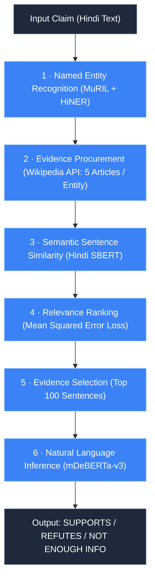
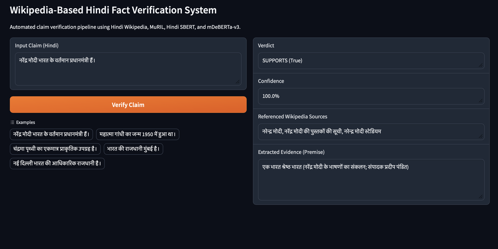

<div align="center">

# Wikipedia-Based Hindi Fact Verfication

An end-to-end pipeline fact verfication pipeline as part of the research paper titled 'Building a Wikipedia-Based Hindi Fact Verification System'

<br/>

[](https://doi.org/10.56975/ijrar.v12i3.318929)
[](LICENSE)
[](https://python.org)
[](https://pytorch.org)
[](https://huggingface.co/)
[](https://gradio.app/)

</div>


The following pipeline integrates Named Entity Recognition (NER), Wikipedia passage procurement, semantic sentence similarity ranking, and Natural Language Inference (NLI) to cross-reference Hindi text claims peer-validated Wikipedia content.

---

## Architectural Pipeline

The system processes input claims through five distinct stages to retrieve supporting or refuting evidence and determine factual veracity:



### Methodological Stages

1. **Entity Extraction (NER):** Key entities are extracted from the claim using a MuRIL model fine-tuned on the HiNER dataset, leveraging bidirectional context representations for Hindi text.
2. **Wikipedia Procurement:** Extracted entities query the Wikipedia search API, retrieving five articles per identified entity. Text extracts are retrieved from each candidate page.
3. **Semantic Similarity & Ranking:** Retrieved text is segmented into sentences and embedded using Hindi SBERT, fine-tuned on the Hindi Semantic Textual Similarity (STS) benchmark. Candidate sentence embeddings are compared to the claim embedding using Mean Squared Error (MSE) loss:

$$\mathcal{L}_{\text{MSE}} = \frac{1}{D} \sum_{i=1}^{D} (e_{\text{sent}, i} - e_{\text{claim}, i})^2$$

4. **Evidence Selection:** The top 100 candidate sentences exhibiting the lowest MSE distance are propagated forward as candidate evidence.
5. **Natural Language Inference (NLI):** A multilingual DeBERTa-v3 model with disentangled attention evaluates the claim (hypothesis) against retrieved evidence (premise) to assign a final verification verdict: **SUPPORTS**, **REFUTES**, or **NOT ENOUGH INFO**.


## User Guide

### 1. Repository Setup

```bash
git clone https://github.com/shauryanagar/hindi-fact-verifier.git
cd hindi-fact-verifier

python3 -m venv venv
source venv/bin/activate  # On Windows: venv\Scripts\activate

pip install --upgrade pip
pip install -r requirements.txt
```

### 2. Model Weights Setup

Place the trained `model_weights.pt` file into the root of the project directory. The verification pipeline will automatically load this checkpoint into `mDeBERTa-v3` for inference.

### 3. Headless CLI Verification

Run inference directly from the command line:

```python
from pipeline import verify_claim

result = verify_claim("नरेंद्र मोदी भारत के वर्तमान प्रधानमंत्री हैं।")

print("Verdict:", result["verdict"])
print("Confidence:", result["confidence"])
print("Sources:", result["sources"])
print("Evidence:", result["evidence"][0])
```

### 4. Interactive Gradio Interface

Launch the local web user interface:

```bash
python app.py
```

Navigate to `http://127.0.0.1:7860` in any web browser.

<br>

The UI should look as follows:
<div align="center">

</div>


---

## Citation

```bibtex
@article{nagar2025hindi,
  title={Building a Wikipedia-Based Hindi Fact Verification System},
  author={Nagar, Shaurya},
  journal={International Journal of Research and Analytical Reviews (IJRAR)},
  volume={12},
  number={3},
  pages={315--321},
  month={August},
  year={2025},
  issn={2348-1269},
  doi={10.56975/ijrar.v12i3.318929},
  url={https://doi.org/10.56975/ijrar.v12i3.318929}
}
```